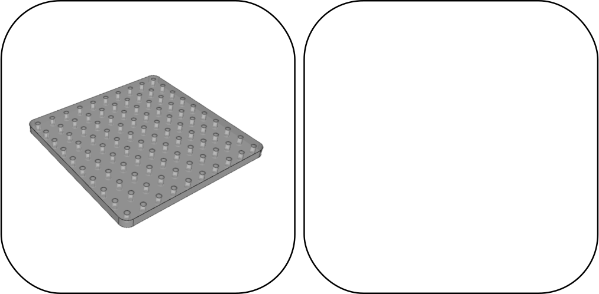
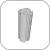
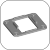
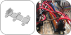

  
   

 
 

# Quick-blocks for easy prototyping
1. [Introduction](#introduction)
0. [Examples](#examples)
1. [Box](#box)
2. [Blocks](#blocks)
4. [Blocks with standard dimensions only](#blocks-with-standard-dimensions-only)

## Introduction
The quick-blocks are parameteric CAD files to 3D print blocks and clip electronics modules (or anything else) on these blocks. Easily assemble, re-arrange, update modules, disassemble your prototype. This quick-block prototyping project was created to **prototype the easy way**, with **modularity** in mind.  
I defined "standard dimensions", and most of STL availables are "standard", and fit with the following dimensions: 
- grid spacing : 10 mm
- screws : M3
- 250x250x70 mm box
- 5 mm thick PMMA (floor, lid, walls)  

But the CAD files are parametric and should work with other dimensions (if not, feel free to share pull requests of your modifications).

## Examples
Here are a few examples of projects I made using the quick-blocks. It really convinced me this project is worth being shared.  

## Box
| Box        | Image     | CAD | STL |
|:---:|:---:|:---:|:---:|
| Box |  | [FreeCAD](cad/box.FCStd) | - |
| Grid M3 dX=10mm dY=10mm Z=5mm |  | [FreeCAD](cad/grid.FCStd) [OpenSCAD](cad/grid.scad) | [50x50](stl/grid_m3-x10-y10_50x50.stl) [100x100](stl/grid_m3-x10-y10_50x50.stl) [150x150](stl/grid_m3-x10-y10_50x50.stl) [200x200](stl/grid_m3-x10-y10_50x50.stl) [250x250](stl/grid_m3-x10-y10_50x50.stl) | [50x50](dxf/grid_m3-x10-y10_50x50.dxf) [100x100](dxf/grid_m3-x10-y10_50x50.dxf) [150x150](dxf/grid_m3-x10-y10_50x50.dxf) [200x200](dxf/grid_m3-x10-y10_50x50.dxf) [250x250](dxf/grid_m3-x10-y10_50x50.dxf)  |
| Generic Column |  | [FreeCAD](cad/column.FCStd) | - |

## Blocks
In this section, you will find parametric files, and most basic blocks.
| Blocks        | Image     | CAD | STL | Components |
|:---:|:---:|:---:|:---:|:---:|
| Generic PCB |  | [OpenSCAD](cad/pcb.scad) | - | Any regular PCB |
| Wago 221 [Adapted from here](https://www.thingiverse.com/thing:2075219/files) |  | [OpenSCAD](cad/wago-221.scad) | - | Most Wago 221 |

## Blocks with standard dimensions only
In this section, only stl files are available, and block were designed for "standard dimensions". There is no links to the CAD files (and some are missing) since most of them were designed on a hurry and definitly need to be designed again.  
Feel free to help updating this section, with new blocks designs, or with parametric CAD.

| Blocks        | Image     | CAD | STL | Components |
|:---:|:---:|:---:|:---:|:---:|
| Arduino Mega Board |  | - | [Arduino Mega Board](stl/arduino_mega_board.stl) | Arduino Mega Boards |
| RaspberryPi 4 |  | - | [RaspberryPi4](stl/raspberrypi4.stl) | RaspberryPi4 |